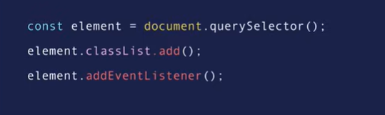

# Air Bnb Very Basic Clone for Learn Fundamentals of React 


As This Repo will be a start point of learning REACT I want to talk about it 

why we care about REACT ?? What is and why we should and when we should use it ?


REACT IS A JavaScript Library that using the approach of creating components (compenent is a piece of the user interface )so when we build an app with REACT we build a bunch of independent isolated reusable componenets to build UI REACT app, which contain at least on component which is the root of the app and this compenent contains other child components so every REACT app is essentially a tree of components.

REACT Component is the return of JavaScript class or function which is a simple plain `JS object` that maps to a DOM Element **so it is not Real DOM Element is just JS object that represents that DOM element in memory so REACT keep lightweight representation of the DOM in the memory which were referred to as `VirtualDOM`** unlike the browser or the real DOM virtualDOM is cheap to create so when we change the state of a component we a get a new REACT element, REACT then will compare this element and his children with the previous one then it figures out what is changed and then it will update a part of the real DOM to keep it in sync with virtual DOM. So building applications with react unlike vanillaJS or jQuery we no longer have to to work with the DOM API in the browsers

in other words we no longer have to write code in query and manipulate DOM or attached event handlers to DOM elements we just change the state of our components and REACT will automatically update the Real DOM to match the updated VirtualDOM


### javascript inside jsx

when we are using {} in jsx every thing we are writing inside the {} is js
when we need to pass data types to jsx as components prop(attribute) we use {} to do it

> the react element receive the props as an object

### object desstructuring

instead of

```js
 const person = {
     img: "./images/mr-whiskerson.png",
     name: "Mr. Whiskerson",
     phone: "(800) 555-1234",
     email: "mr.whiskaz@catnap.meow"
 }

console.log(person.img);

// WE can disStructure the object like

let {img, name , phone,email}= perosn;
// it the same like let img = person.img
// let name = person.name etc..

export default function Component (props)
{
  return (
    props.name
  )
}


// OR


export default function Component({name})
{
  return name
}


// using props is more easy because if you defined a varibale inside the component we can notice the probs and not get confused by them and the variables

```

> we cannot change the name of the property when we bring it in we need to make sure that is exactly as the prop has been passed at the time that component been rendering

with

```jsx
{...obj,propertyname:!obj.propertyname }
// we 're passing object like it was but we 'are over writing a propery we choose
```

### spread object as props

```react
<Card {item=item}/>
<!--  the idea is instead of creating  my own prop called item that i pas the entire object in the example above  waht i can actually do is just  put  aset of curly braces and spread  the item into my components  props essntially what this does is  it takes the properties of the data and creates a separate prop for each one of them kinda we had before we were pasing in the item individually  -->


<Card {...item}/>
<!--  it same to  -->
<Card  id={item.id} name= {item.name} ..etc />
<!-- it still doing that until conver every prop in element we passing to our component -->


```

### event listener

[all supported Events legacy](https://legacy.reactjs.org/docs/events.html#mouse-events)

```jsx
export default function App() {
  function handleClick() {
    console.log("I was clicked!");
  }

  /**
   * Add our new function to the button
   */

  return (
    <div className="container">
      
      <button onClick={handelClick}>Click me</button>
    </div>
  );
}

> you can not put handleClick with () paranthesis because as soon as  you run  the code it run the function so we don't need that set of () here because that the program wil run the function as soon as  the program read the line of code instead of that WE WILL PASS THE FUNCTION AS VALUE  that react can add that function as event handler in case when click ever happens on the button
```

even when we declare (like global var inside the component) the UI not gonna update ,this has everything to do with the way that react looks at variables and decides when it should update the UI.
SPOILER ALERT : It Doesn't do that by just looking at every variable that we declared inside of our component

```jsx
// Setting state from child components
<Star isFilled={contact.isFavorite} onClick={toggleFavorite} />
// why on click doesn't work here ? when we have component we've created  all props that we passed it is custom props
// SO SIMPLY PUTTING ONCLICK HERE DOESN'T MAGICALLY  REGISTER IT AS EVENT LISTENER  THE ONCLICK EVENT LISTENER NEED TO EXIST ON  NATIVE DOM ELEMENTS
// ,because these what actually  get created  into real DOM
```

> Passing function to the child components(as Props) from the parent components give it ability to setting state from it (child component)


### Routes

how to build website with multiple pages in react ??
react product DOM library which allow us to have multiple pages in react even thought react is signle page application all it does is depending on what route you're in will render different components i think you need to learn it after learning hooks and building some projects

api fetch data useaffect hook build website that consume API

<!-- spacex api  -->

### statement management in react

learn context api library which already comes with react there you'll learn useContext hook.
ther's other alternatives out there very famous ones Redux (redux it great tool is great for projects) any thing after that will be based on things you already know

project structure folder structure how to organize code better how to create project maintainable also integragin other technologies

- [ ] js intepelletions

```jsx

```

sneak peak

- [ ] Warning: Each child in a list should have a unique "key" prop. Check the render method of `App`. See https://reactjs.org/link/warning-keys for more information. at Card (exe1.bundle.js:194:29) at App ?? we will see this warning any time we are using data.map to create jsx elements or rather an array of jsx elemets . the way to get red of this warning is by simply adding prob call key = {SomeThingUnique} usually gonna be an id


